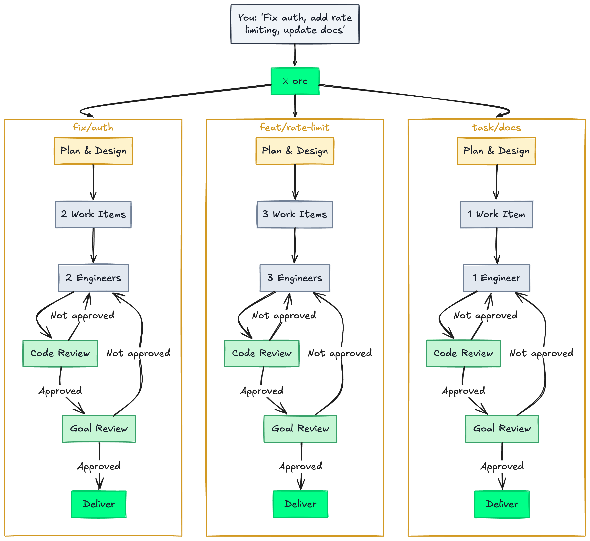

<p align="center">
  
</p>

<p align="center">
  <strong>Turn one prompt into a team of AI agents that plan, build, review, and ship.</strong>
  <br />
  <em>Your tools. Your workflow. Your rules. No daemon, no server, no lock-in.</em>
</p>

<p align="center">
  <a href="#quick-start"></a>
  <a href="#configuration"></a>
  
  
  
</p>

> **orc** */ork/* — a creature known for strength in numbers, brutal efficiency, and an unwavering commitment to getting the job done. Also: an **orc**hestration layer for AI agents. Coincidence? Absolutely not.

---

## The Problem

You ask an AI agent to build a feature. It works for 20 minutes, dumps a half-finished diff, and you spend the afternoon cleaning up. Try three agents at once and you get merge conflicts, duplicated work, and zero visibility into what's happening.

AI agents are powerful. But without structure — a plan, isolated workspaces, code review, and a delivery pipeline — they're chaos.

Orc gives them structure.

## Key Concepts

Four ideas are all you need to understand orc:

| Concept | What it is | Think of it as... |
|---------|-----------|-------------------|
| **Goal** | A deliverable with its own git branch. "Add rate limiting" is a goal. | A ticket on your board |
| **Bead** | A focused work item within a goal. One engineer, one worktree, one bead. | A subtask — small enough to complete and review in one pass |
| **Orchestrator** | An AI agent that coordinates work but never writes code. Three tiers: root (cross-project), project (manages goals), goal (manages beads). | A tech lead who delegates but never opens an IDE |
| **Worktree** | An isolated git checkout. Each engineer works in its own copy of the repo. No conflicts during development. | Each engineer gets their own sandbox |

Everything else is configuration. [Deep dive &rarr;](docs/concepts.md)

## The 30-Second Version

<p align="center">
  
</p>

You describe the work. Orc fans it out to parallel goals — each runs its own lifecycle: plan, decompose into work items, dispatch engineers in isolated worktrees, review every piece, merge, and deliver. Every phase is a configurable hook. [Deep dive into the lifecycle &rarr;](docs/concepts.md#the-lifecycle)

<p align="center">
  
  <br />
  <sub>A goal orchestrator (left) dispatches and monitors engineers working in isolated worktrees (right).</sub>
</p>

## What Happens When You Run Orc

```bash
orc myapp
> "Add rate limiting to all public API endpoints. Use Redis for the token bucket."
```

Here is what happens next:

1. **The project orchestrator investigates** — spawns scout agents to explore your codebase, understands the architecture, identifies relevant files and patterns.
2. **It creates goals** — "add-rate-limiting" gets a dedicated branch (`feat/add-rate-limiting`).
3. **The goal orchestrator plans** — if configured, a planner sub-agent creates design docs or specs using your tool (OpenSpec, Kiro, or plain markdown). You review if you want to.
4. **It decomposes into beads** — the plan becomes focused work items: "rate-limiter-middleware", "config-endpoint", "rate-limit-tests".
5. **Engineers dispatch** — each bead spawns an engineer in an isolated worktree. Three agents working in parallel, zero conflicts.
6. **Review runs automatically** — each bead is reviewed before merging to the goal branch. Not approved? The engineer gets feedback and fixes it.
7. **Delivery executes** — your configured pipeline runs: push the branch, create a PR, update the Jira ticket, archive the spec.
8. **You come back to a clean goal branch** ready to merge — or an open PR ready to review.

## Quick Start

### Prerequisites

| Tool | Purpose | Install |
|------|---------|---------|
| [Beads](https://github.com/thefinalsource/beads) (`bd`) | Work tracking (Dolt-backed) | See Beads repo |
| [tmux](https://github.com/tmux/tmux) 3.0+ | Session management | `brew install tmux` / `apt install tmux` |
| `git` | Worktrees and branching | Pre-installed on most systems |
| `bash` 3.2+ | CLI runtime | Pre-installed on macOS and Linux |
| Agent CLI | Your AI coding agents | [Claude Code](https://docs.anthropic.com/en/docs/claude-code), [OpenCode](https://opencode.ai), [Codex](https://github.com/openai/codex), or [Gemini CLI](https://github.com/google-gemini/gemini-cli) |

Optional: [`gh`](https://cli.github.com/) — only needed if you want orc to auto-create PRs.

### Install

```bash
git clone https://github.com/thefinalsource/orc.git
cd orc && pnpm install
pnpm orc:install
```

> This symlinks `orc` to your PATH, creates config files, and installs slash commands for your agent CLI.

### Register a project

```bash
orc add myapp /path/to/myapp
```

> **What this touches in your project:** `orc add` initializes a `.beads/` directory for work tracking (via `bd init`) and adds orc runtime paths (`.beads/`, `.worktrees/`, `.goals/`) to your repo's `.git/info/exclude` so they're invisible to git. No files in your project are modified — orc uses git's built-in per-repo exclude, not your `.gitignore`.

### Configure (optional)

```bash
orc setup myapp       # Guided — discovers your tools and asks about your workflow
```

### Launch

```bash
orc myapp             # Start the project orchestrator
orc myapp --yolo      # Full autonomy — no confirmation prompts
```

[What does `orc add` touch in my project? &rarr;](docs/setup.md) | [YOLO mode &rarr;](docs/yolo-mode.md)

## Usage

### Multi-project orchestration

```bash
orc                   # Root orchestrator — coordinates across all projects
```

Tell it what you need across projects. It routes each piece to the right project orchestrator.

### Single-project

```bash
orc myapp             # Jump straight to one project
```

Describe the work. The orchestrator decomposes, dispatches, reviews, and delivers.

### Jump into a worktree

```bash
orc myapp bd-a1b2     # Attach to an engineer's tmux pane
```

Give context, take over, or just watch. You're never locked out.

[Configuration guide &rarr;](docs/configuration.md) | [Planning lifecycle &rarr;](docs/planning.md) | [Delivery pipeline &rarr;](docs/delivery.md)

## Architecture

### The Lifecycle

Every goal follows the same configurable lifecycle:

```
Investigate -> Plan -> Decompose -> Dispatch -> Build -> Review -> Deliver
```

| Phase | What happens | You configure |
|-------|-------------|---------------|
| **Investigate** | Scouts explore the codebase | (automatic) |
| **Plan** | Planner creates design docs, specs, task lists | `plan_creation_instructions` |
| **Decompose** | Goal orchestrator maps plan to beads | `bead_creation_instructions` |
| **Dispatch** | Engineers spawn in isolated worktrees | `assignment_instructions` |
| **Build** | Engineers implement in parallel | (automatic) |
| **Review** | Two-tier review loop | `review_instructions` |
| **Deliver** | Push, PR, ticket updates | `on_completion_instructions` |

Every field is natural language. Empty = sensible default. [Full lifecycle deep dive &rarr;](docs/concepts.md#the-lifecycle)

### Agent Hierarchy

```
Root Orchestrator --- cross-project coordination
  +-> Project Orchestrator --- creates goals, monitors progress
        +-> Goal Orchestrator --- owns one goal, manages the full lifecycle
              +-> Planner (ephemeral) --- creates plan artifacts
              +-> Scouts (ephemeral) --- investigate codebase
              +-> Worktree --- isolated git worktree per bead
                    +-- Engineer (persistent) --- implements the bead
                    +-- Reviewer (ephemeral) --- reviews the work
```

[Concepts deep dive &rarr;](docs/concepts.md) | [Supported agent CLIs &rarr;](docs/agent-clis.md)

## CLI Reference

### Navigation

```bash
orc                            # Root orchestrator
orc <project>                  # Project orchestrator
orc <project> <bead>           # Jump to an engineer's worktree
```

### Commands

| Command | Description |
|---------|-------------|
| `orc init` | First-time setup |
| `orc add <key> <path>` | Register a project |
| `orc remove <key>` | Unregister a project |
| `orc list` | Show registered projects |
| `orc status` | Dashboard |
| `orc setup <project>` | Guided config setup |
| `orc doctor [--fix\|--interactive]` | Validate config / migration |
| `orc notify [--all\|--clear\|--goto N]` | View notifications |
| `orc halt <project> <bead>` | Stop an engineer |
| `orc teardown [project] [bead]` | Cleanup |
| `orc config [project]` | Edit config |
| `orc board <project>` | Board view |
| `orc leave` | Detach from tmux |

Exit codes: `0` success, `1` usage error, `2` state error, `3` project not found.

## Slash Commands

Slash commands are how agents coordinate within orc. Each role has access to specific commands:

| Command | Role | What it does |
|---------|------|----------|
| `/orc` | Any | Orientation |
| `/orc:status` | Any | Dashboard |
| `/orc:plan` | Orchestrator | Decompose into goals or beads |
| `/orc:dispatch` | Orchestrator | Spawn workers |
| `/orc:check` | Orchestrator | Poll statuses |
| `/orc:complete-goal` | Goal Orch | Trigger delivery |
| `/orc:view` | Orchestrator | tmux layouts |
| `/orc:done` | Engineer | Signal review |
| `/orc:blocked` | Engineer | Signal blocked |
| `/orc:feedback` | Engineer | Address review feedback |
| `/orc:leave` | Any | Detach |

## Configuration

Config uses TOML with three-tier resolution (most specific wins):

```
{project}/.orc/config.toml -> config.local.toml -> config.toml
```

Quick examples:

```toml
# Planning — plug in your tool
[planning.goal]
plan_creation_instructions = "/openspec:proposal"
bead_creation_instructions = "Decompose from tasks.md. Each bead = one or more tasks."
when_to_involve_user_in_plan = "when the plan involves more than 3 beads"

# Delivery — describe your pipeline
[delivery.goal]
on_completion_instructions = "Push the branch, create a PR targeting main, update the Jira ticket."
when_to_involve_user_in_delivery = "always"

# Review — use your own tools
[review.goal]
review_instructions = "/ocr:review"
how_to_determine_if_review_passed = "No must-fix items in the review output"
```

[Full configuration reference &rarr;](docs/configuration.md)

## Troubleshooting

<details>
<summary><strong><code>bd: command not found</code></strong></summary>

Install [Beads](https://github.com/thefinalsource/beads). It's the work tracking layer orc depends on.

</details>

<details>
<summary><strong>tmux session died or agents are unresponsive</strong></summary>

Just run `orc` or `orc <project>` again — it recreates the session and reattaches. To clean up stale state: `orc teardown`.

</details>

<details>
<summary><strong>Engineer is stuck or blocked</strong></summary>

The `.worker-status` file in the worktree will say `blocked: <reason>`. Options:
- Provide context to unblock the engineer
- Tear down and respawn: `orc teardown <project> <bead>`, then re-dispatch

</details>

<details>
<summary><strong>Merge conflict on bead merge</strong></summary>

Orc escalates merge conflicts to you — it never force-pushes or auto-resolves. Resolve manually on the goal branch, then continue.

</details>

<details>
<summary><strong>Too many workers / spawn blocked</strong></summary>

Increase the limit: `orc config` then set `max_workers = 5` under `[defaults]`.

</details>

<details>
<summary><strong>Agents using the wrong CLI</strong></summary>

Set `agent_cmd` in your config. Globally: `orc config` then `[defaults] agent_cmd = "opencode"`. Per-project: create `{project}/.orc/config.toml`. See [Supported Agent CLIs](docs/agent-clis.md) for all options.

</details>

<details>
<summary><strong>Custom CLI not launching correctly</strong></summary>

If your agent CLI uses non-standard flags, set `agent_template` to control the exact launch command:

```toml
[defaults]
agent_cmd = "my-agent"
agent_template = "my-agent --system {prompt_file} --input {prompt}"
```

Check `packages/cli/lib/adapters/generic.sh` for the full template placeholder reference.

</details>

## Learn More

| Topic | Link |
|-------|------|
| Core concepts (goals, beads, orchestrators, worktrees) | [docs/concepts.md](docs/concepts.md) |
| Full configuration reference | [docs/configuration.md](docs/configuration.md) |
| Planning lifecycle | [docs/planning.md](docs/planning.md) |
| Review loop | [docs/review.md](docs/review.md) |
| Delivery pipeline | [docs/delivery.md](docs/delivery.md) |
| Notifications | [docs/notifications.md](docs/notifications.md) |
| Project setup & config doctor | [docs/setup.md](docs/setup.md) |
| Supported agent CLIs | [docs/agent-clis.md](docs/agent-clis.md) |
| tmux layout & navigation | [docs/tmux-layout.md](docs/tmux-layout.md) |
| Customizing personas | [docs/personas.md](docs/personas.md) |
| YOLO mode | [docs/yolo-mode.md](docs/yolo-mode.md) |

---

<p align="center">
  <strong>Shell over runtime. Markdown is the control plane. Beads are the only state.</strong>
  <br />
  <em>Now go. Release the horde.</em>
</p>

---

## License

See [LICENSE](LICENSE) for details.
